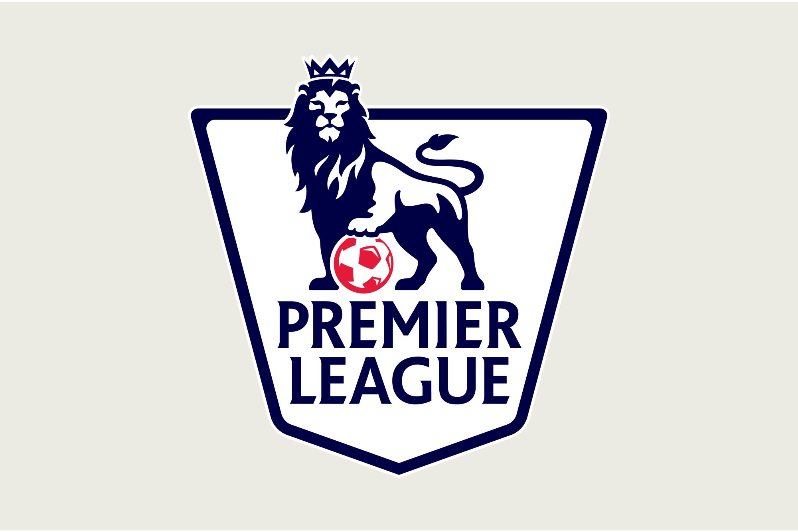

# EPL Competitive Balance Analysis

**Authors**: Rahul Purushottam Gaonkar (rpg283), Achyut Tibrewalla (at3617), Divyanshu Singh (ds5387)

Group 3 Online

## About
The English Premier League is the top level of the English football league system. Contested by 20 clubs, it operates on a system of promotion and relegation. The top 4 teams of the English Premier League get qualified for the UEFA Champions League. The bottom 3 teams get relegated to a lower division league (EFL Championship).  

The main goal of the project is to show how the distribution of teams change based on league positions over different seasons and factors contributing to it. The project will try to convey how the traditional top 4 (Manchester United, Arsenal, Liverpool and Chelsea) and bottom 3 teams (relegated teams) changed over different seasons.

## More
[DEMO](https://nyu-vis-fall2018.github.io/storytelling-group-3-online-EPL-Competitive-Balance-Analysis/)

[Project Description](Report/Information_Visualization_Project_Proposal.pdf)
